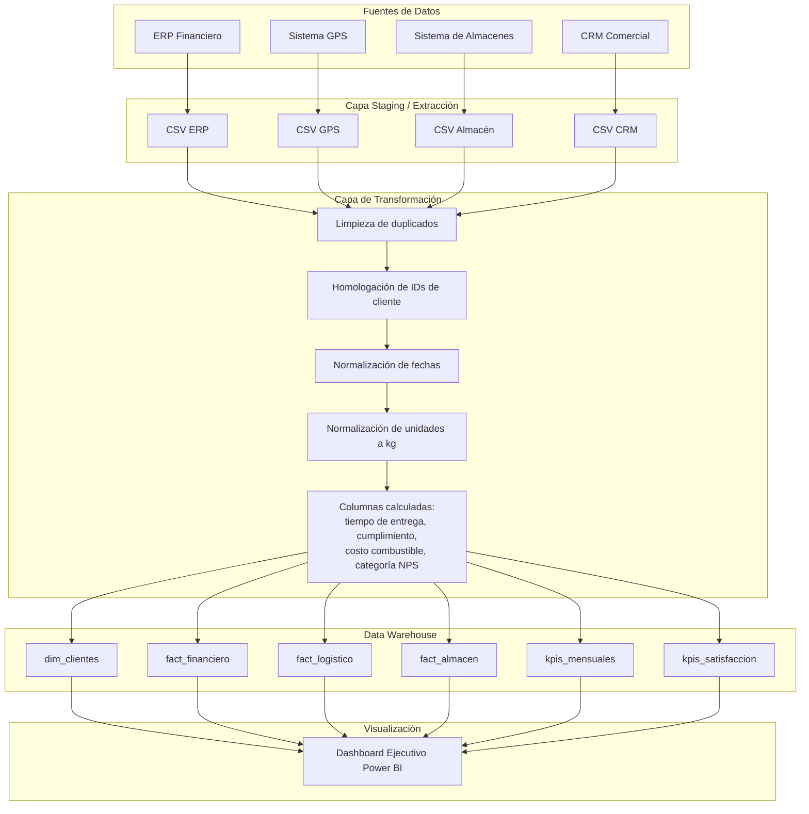

# Diagrama del Proceso ETL

## Arquitectura General

## Flujo Detallado por Fuente

### 1. ERP Financiero
- **Extrae:** `id_factura`, `cliente_id`, `region`, `fecha_emision`, `monto_usd`, `costo_logistico_usd`, `estado_pago`, `vendedor_id`
- **Problemas detectados:** IDs de cliente inconsistentes (`CLI-`, `cliente_`, `C-`), duplicados exactos, fechas en formato `dd/mm/yyyy`, estados de pago faltantes.
- **Transformaciones:**
  - Homologar `cliente_id` a formato `CLI-XXXX`
  - Parsear fechas a formato ISO
  - Eliminar duplicados exactos
  - Imputar estados de pago faltantes como "Pendiente"
  - Crear columna `mes`
- **Carga:** Tabla `fact_financiero`

### 2. Sistema GPS
- **Extrae:** `id_viaje`, `vehiculo_id`, `tipo_vehiculo`, `fecha`, `hora_salida`, `hora_llegada_real`, `hora_llegada_estimada`, `distancia_km`, `numero_entregas`, `combustible_litros`, `estado_viaje`
- **Problemas detectados:** Duplicados, fechas en formatos mixtos (`yyyy-mm-dd`, `mm/dd/yyyy`).
- **Transformaciones:**
  - Parsear fechas
  - Calcular `tiempo_entrega_horas`
  - Calcular `tiempo_estimado_horas`
  - Calcular `diferencia_tiempo_horas`
  - Crear `cumplimiento` (A tiempo / Retrasado)
  - Calcular `costo_combustible_usd`
  - Eliminar duplicados
- **Carga:** Tabla `fact_logistico`

### 3. Sistema de Almacenes
- **Extrae:** `id_despacho`, `cliente_id`, `producto`, `cantidad`, `unidad_medida`, `fecha_despacho`, `bodega_origen`, `peso_bruto`, `peso_unidad`
- **Problemas detectados:** Unidades de medida variadas (`kg`, `ton`, `lb`, `cajas`, `pallets`), IDs de cliente inconsistentes, pesos faltantes, fechas en formato `dd-mmm-yyyy`.
- **Transformaciones:**
  - Homologar `cliente_id`
  - Normalizar unidades a kilogramos (`cantidad_kg`, `peso_bruto_kg`)
  - Imputar pesos faltantes a partir de la cantidad
  - Parsear fechas
- **Carga:** Tabla `fact_almacen`

### 4. CRM Comercial
- **Extrae:** `id_cliente_crm`, `nombre_cliente`, `sector`, `region_comercial`, `satisfaccion_nps`, `fecha_ultima_encuesta`, `ejecutivo_cuenta`, `estado_cliente`
- **Problemas detectados:** IDs inconsistentes, duplicados parciales por cliente, encuestas sin respuesta.
- **Transformaciones:**
  - Homologar `id_cliente_crm`
  - Eliminar duplicados por cliente
  - Clasificar NPS en Promotor / Neutro / Detractor
- **Carga:** Tabla `dim_clientes`

## Modelo Dimensional Resultante

| Tabla | Tipo | Descripción |
|-------|------|-------------|
| `dim_clientes` | Dimensión | Catálogo maestro de clientes con sector, región, satisfacción e ingresos |
| `fact_financiero` | Hechos | Transacciones financieras por factura |
| `fact_logistico` | Hechos | Viajes y entregas con tiempos y cumplimiento |
| `fact_almacen` | Hechos | Despachos de bodega con cantidades normalizadas |
| `kpis_mensuales` | Agregado | Indicadores consolidados por mes |
| `kpis_satisfaccion` | Agregado | Distribución de NPS |
