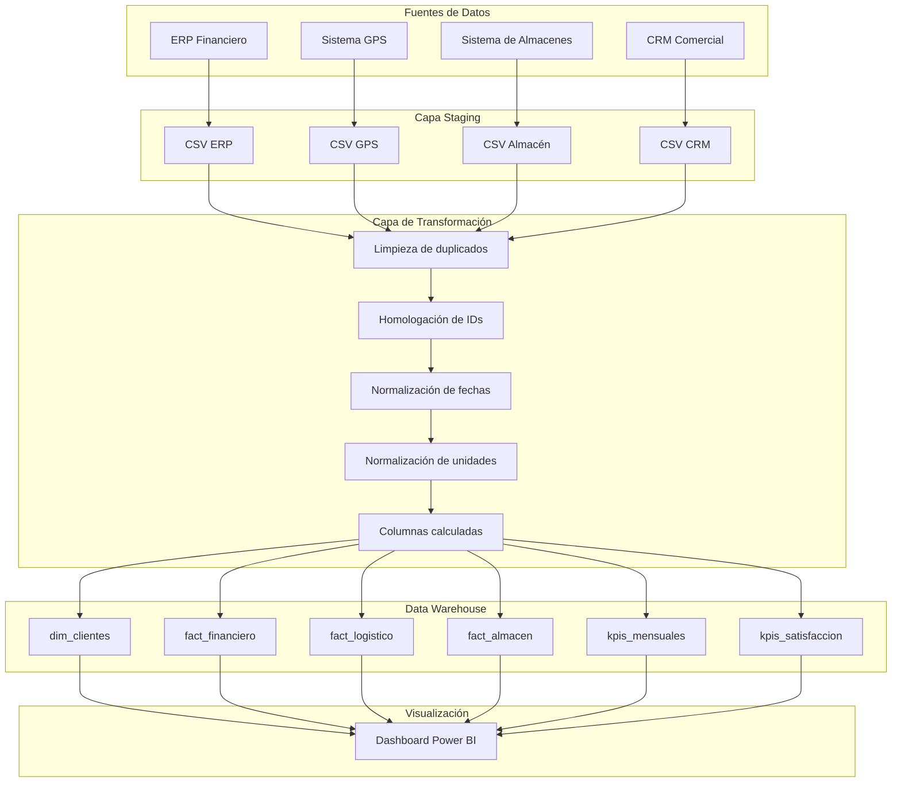
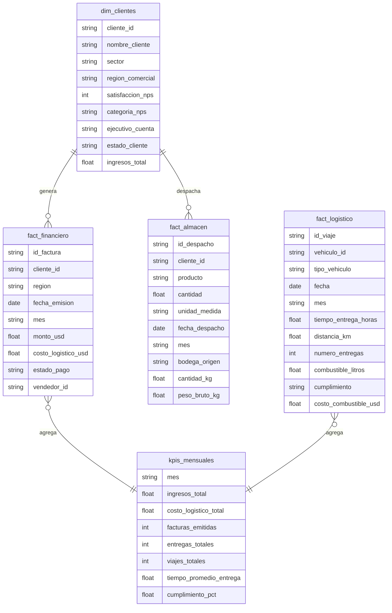
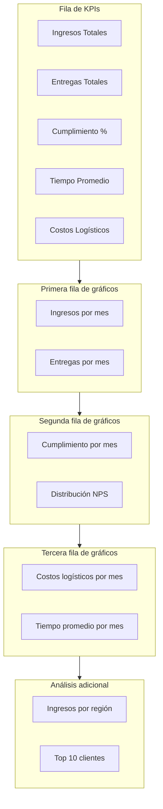

# Informe Técnico: Proceso ETL y Dashboard Ejecutivo

**Logística Inteligente del Pacífico S.A.**  
Caso empresarial - Ejercicio Propuesto 2  
Julio 2026

---

## 1. Resumen Ejecutivo

El presente informe describe el diseño, implementación y resultados de un proceso ETL (Extracción, Transformación y Carga) completamente automatizado para **Logística Inteligente del Pacífico S.A.** El objetivo fue consolidar información proveniente de cuatro sistemas independientes —ERP financiero, sistema GPS, sistema de almacenes y CRM comercial— en un Data Warehouse centralizado que alimenta un dashboard ejecutivo para la toma de decisiones estratégicas.

Se identificaron y corrigieron problemas críticos de calidad de datos: registros duplicados, clientes con múltiples identificadores, formatos inconsistentes de fechas, unidades de medida heterogéneas y campos incompletos. El resultado es un modelo dimensional robusto con tablas de hechos financieros, logísticos y de almacén, y una dimensión de clientes.

> **[aquí va una captura de la página de inicio del dashboard en Power BI mostrando los KPIs principales]**

---

## 2. Análisis de Fuentes de Datos

La empresa opera con cuatro sistemas independientes que generan datos diarios con diferentes estructuras y niveles de calidad:

### 2.1 ERP Financiero
- **Registra:** facturas, pagos, costos logísticos y vendedores.
- **Campos clave:** `id_factura`, `cliente_id`, `region`, `fecha_emision`, `monto_usd`, `costo_logistico_usd`, `estado_pago`, `vendedor_id`.
- **Volumen aproximado:** ~1,200 facturas mensuales.

### 2.2 Sistema GPS
- **Registra:** viajes de vehículos, tiempos de salida/llegada, distancias, combustible y número de entregas.
- **Campos clave:** `id_viaje`, `vehiculo_id`, `fecha`, `hora_salida`, `hora_llegada_real`, `hora_llegada_estimada`, `distancia_km`, `combustible_litros`.
- **Volumen aproximado:** ~1,500 viajes mensuales.

### 2.3 Sistema de Almacenes
- **Registra:** despachos de productos con cantidades y unidades de medida variadas.
- **Campos clave:** `id_despacho`, `cliente_id`, `producto`, `cantidad`, `unidad_medida`, `fecha_despacho`, `bodega_origen`, `peso_bruto`.
- **Volumen aproximado:** ~1,000 despachos mensuales.

### 2.4 CRM Comercial
- **Registra:** información de clientes, sectores, regiones comerciales y satisfacción (NPS).
- **Campos clave:** `id_cliente_crm`, `nombre_cliente`, `sector`, `region_comercial`, `satisfaccion_nps`, `estado_cliente`.
- **Volumen aproximado:** ~50 clientes activos.

> **[aquí va una captura de los archivos CSV crudos abiertos en Excel o VS Code mostrando las diferentes estructuras y formatos]**

---

## 3. Problemas de Calidad de Datos Identificados

Durante el análisis exploratorio se detectaron los siguientes problemas de calidad:

| Problema | Fuente afectada | Impacto |
|----------|-----------------|---------|
| Registros duplicados | ERP, GPS, CRM | Sobrestimación de ingresos, viajes y clientes |
| Identificadores de cliente inconsistentes | ERP, Almacén, CRM | Imposibilidad de cruzar información entre sistemas |
| Fechas en múltiples formatos | ERP, GPS, Almacén, CRM | Errores de agrupación temporal |
| Unidades de medida heterogéneas | Almacén | Cálculos incorrectos de peso y volumen |
| Pesos brutos faltantes | Almacén | Pérdida de información logística |
| Estados de pago faltantes | ERP | Reportes financieros incompletos |
| Encuestas NPS sin respuesta | CRM | Métricas de satisfacción sesgadas |

> **[aquí va una captura del resumen de limpieza mostrado en consola al ejecutar el ETL, con la cantidad de duplicados eliminados por fuente]**

---

## 4. Arquitectura del Proceso ETL

La arquitectura del proceso ETL consta de cuatro capas principales:

1. **Fuentes de datos:** Los cuatro sistemas de origen exportan archivos CSV con la información operativa.
2. **Capa Staging:** Los archivos CSV se almacenan en `data/raw/` sin modificar para conservar el estado original.
3. **Capa de transformación:** El script `etl/etl_process.py` ejecuta limpieza, homologación, normalización y cálculo de columnas derivadas.
4. **Data Warehouse:** Los datos transformados se cargan en SQLite (`database/logistica_dw.sqlite`) siguiendo un modelo dimensional con tablas de hechos y dimensiones.
5. **Visualización:** Power BI Desktop consume el Data Warehouse y presenta el dashboard ejecutivo.

### Diagrama de arquitectura por capas



> **[aquí va una captura de la consola mostrando la ejecución exitosa del script `python run_all.py` o `python etl/etl_process.py`]**

---

## 5. Proceso de Transformación

El proceso de transformación aplica las siguientes reglas por fuente:

### 5.1 Limpieza de duplicados
Se eliminan registros completamente idénticos usando `drop_duplicates()` de pandas. Para el CRM se eliminan duplicados por `cliente_id` conservando el primer registro.

### 5.2 Homologación de identificadores
La función `homologar_cliente_id()` convierte cualquier variante de ID de cliente (`CLI-XXXX`, `cliente_XXXX`, `C-XXXX`) al formato estándar `CLI-XXXX` mediante expresiones regulares.

### 5.3 Normalización de fechas
La función `parse_fecha()` prueba múltiples formatos (`dd/mm/yyyy`, `yyyy-mm-dd`, `mm/dd/yyyy`, `dd-mmm-yyyy`, `yyyy/mm/dd`) hasta obtener un objeto `datetime` consistente.

### 5.4 Normalización de unidades
Todas las cantidades y pesos se convierten a kilogramos:
- `ton` × 1000
- `lb` × 0.453592
- `cajas` × 12
- `pallets` × 500

### 5.5 Imputación de faltantes
- Pesos faltantes se imputan a partir de la cantidad convertida.
- Estados de pago faltantes se marcan como `Pendiente`.

### 5.6 Columnas calculadas
- **GPS:** `tiempo_entrega_horas`, `tiempo_estimado_horas`, `diferencia_tiempo_horas`, `cumplimiento`, `costo_combustible_usd`.
- **CRM:** `categoria_nps` (Promotor / Neutro / Detractor).
- **Financiero:** `mes` a partir de `fecha_emision`.

> **[aquí va una captura de un fragmento del código `etl_process.py` mostrando las funciones de homologación y normalización]**

---

## 6. Modelo de Datos y Data Warehouse

El Data Warehouse se implementó en SQLite con un esquema estrella. Las tablas principales son:

| Tabla | Tipo | Descripción |
|-------|------|-------------|
| `dim_clientes` | Dimensión | Catálogo maestro de clientes con sector, región, satisfacción e ingresos |
| `fact_financiero` | Hechos | Transacciones financieras por factura |
| `fact_logistico` | Hechos | Viajes y entregas con tiempos y cumplimiento |
| `fact_almacen` | Hechos | Despachos de bodega con cantidades normalizadas |
| `kpis_mensuales` | Agregado | Indicadores consolidados por mes |
| `kpis_satisfaccion` | Agregado | Distribución de NPS |

### Diagrama del modelo dimensional



> **[aquí va una captura de la vista de Modelo en Power BI mostrando las tablas y sus relaciones]**

---

## 7. Dashboard Ejecutivo

El dashboard ejecutivo incluye los siguientes indicadores y visualizaciones:

- **KPI de ingresos:** total y tendencia mensual de ingresos por facturación.
- **KPI de entregas:** total de entregas y número de viajes realizados.
- **KPI de cumplimiento:** porcentaje de viajes entregados a tiempo.
- **KPI de satisfacción:** distribución de NPS (Promotores, Neutros, Detractores).
- **Costos logísticos:** suma de costos logísticos de facturas y combustible.
- **Tiempo promedio de entrega:** evolución mensual en horas.
- **Segmentación por regiones:** ingresos por región comercial.
- **Tendencias mensuales:** análisis de todos los indicadores a lo largo del tiempo.

### Diseño propuesto del dashboard



> **[aquí va una captura completa del dashboard en Power BI con todos los visuales armados]**

### Ejemplo de medidas DAX utilizadas

```dax
Ingresos Totales = SUM('fact_financiero'[monto_usd])

Costos Logísticos = SUM('fact_financiero'[costo_logistico_usd]) + SUM('fact_logistico'[costo_combustible_usd])

Cumplimiento % = 
DIVIDE(
    CALCULATE(COUNTROWS('fact_logistico'), 'fact_logistico'[cumplimiento] = "A tiempo"),
    COUNTROWS('fact_logistico'),
    0
) * 100

Tiempo Promedio Entrega = AVERAGE('fact_logistico'[tiempo_entrega_horas])
```

> **[aquí va una captura del panel de medidas DAX en Power BI]**

---

## 8. Recomendaciones para la Alta Dirección

1. **Implementar un master de clientes (MDM):** evitar múltiples identificadores y garantizar la trazabilidad entre sistemas.
2. **Estandarizar formatos en origen:** fechas y unidades de medida uniformes reducen la complejidad del ETL.
3. **Controles de calidad automáticos:** validación de duplicados, campos obligatorios y rangos en los puntos de ingreso de datos.
4. **Priorizar el cumplimiento de entregas:** los niveles actuales rondan el 45-50%, lo cual impacta directamente la satisfacción del cliente.
5. **Análisis de rentabilidad por región y tipo de vehículo:** optimizar la asignación de recursos logísticos.
6. **Automatizar la ejecución diaria del ETL:** mediante Windows Task Scheduler o Apache Airflow para mantener el dashboard actualizado.
7. **Adoptar Power BI Service:** publicar el dashboard y habilitar acceso desde dispositivos móviles y la alta dirección.
8. **Definir SLAs de respuesta ante incidencias:** asegurar la confiabilidad del tablero ejecutivo.

---

## 9. Conclusiones

El proceso ETL implementado permite consolidar diariamente la información de los cuatro sistemas de Logística Inteligente del Pacífico S.A., transformando datos con problemas de calidad en un modelo dimensional confiable. El dashboard ejecutivo resultante proporciona visibilidad inmediata sobre ingresos, entregas, cumplimiento, satisfacción y costos logísticos, apoyando la planificación estratégica de la organización.

Los entregables finales del proyecto son:
- Proyecto ETL completo (`etl/etl_process.py`)
- Base de datos final (`database/logistica_dw.sqlite`)
- Dashboard Power BI (`dashboard/dashboard_ejecutivo.pbix`)
- Informe técnico (`docs/Informe_Tecnico_ETL.md`)
- Diagrama del flujo ETL (`diagrams/diagrama_etl.md`)

---

## Anexos

### A. Estructura del repositorio

```
lab11/
├── data/
│   ├── raw/                    # Datos crudos de las 4 fuentes
│   └── processed/              # Datos limpios y transformados
├── database/
│   └── logistica_dw.sqlite     # Data Warehouse final
├── dashboard/
│   └── dashboard_ejecutivo.pbix # Dashboard en Power BI
├── diagrams/
│   └── diagrama_etl.md         # Diagrama del flujo ETL
├── docs/
│   ├── Informe_Tecnico_ETL.md  # Este informe
│   └── Informe_Tecnico_ETL.docx # Versión en Word
├── etl/
│   ├── generate_sample_data.py # Generador de datos de ejemplo
│   └── etl_process.py          # Proceso ETL completo
├── requirements.txt
├── run_all.py
└── README.md
```

### B. Cómo ejecutar el proyecto

```bash
# Instalar dependencias
pip install -r requirements.txt

# Ejecutar todo el pipeline
python run_all.py
```

> **[aquí va una captura del repositorio en GitHub mostrando la estructura de archivos]**
